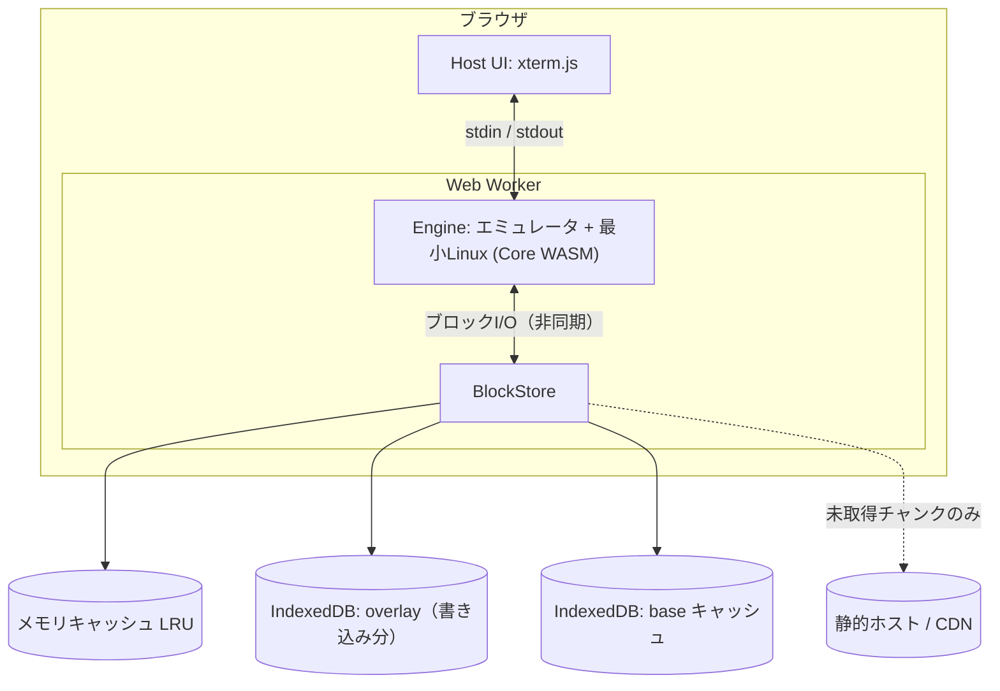

# WasmBox アーキテクチャ

> **Status:** Draft v0.2（2026-10-09）— M1 実装済み、M2（v86 接続）に着手
> このドキュメントは「いま何が決まっていて、何が未決か」を共有するためのもの。
> 開発者が増えても、AIが入れ替わっても、これを読めば追いつける状態を保つ。

各項目の状態は次の4種で表す。

| 記号 | 意味 |
|---|---|
| ✅ 決定 | 方針として確定。変えるときは決定ログに理由を残す |
| 📝 仮決め | 初期値として置いた。計測して見直す |
| 🔬 要検証 | 実現性や最新状況を確認してから確定する |
| ❓ 未決 | まだ決めていない |

---

## 1. ゴール

ブラウザ内で **Linux（WASM上）を動かし、その中で任意のコマンドを実行できる仮想OS** を作る。

- StackBlitz（WebContainers）のような「Web Node.js専用」ではなく、**汎用的なLinux環境**を目指す。
- Python と Node.js は必要性が極めて高いので **デフォルトで利用可能** にする。
- 永続ストレージは **IndexedDB**。
- メモリ使用量はなるべく小さく。ただし多少の重さは受け入れる。

### 非ゴール（少なくとも初期は）

- 完全な速度（ネイティブ並み）。エミュレーションを使う以上、遅さは前提。
- GUI / デスクトップ環境。まずはターミナルのみ。
- マルチユーザー・サーバー側の実行。すべてクライアント内で完結させる。

---

## 2. 設計方針

1. ✅ **エミュレータ型で本物のLinuxを動かす。** 互換性（bash, apk, Python, Node など）を最優先する。
2. ✅ **ディスクは遅延ストリーミング。** イメージを丸ごとメモリやダウンロードに載せず、触られたチャンクだけ取得する。
3. ✅ **書き込みはメモリ上でライトバック。** IndexedDBへは非同期にまとめて書く。
4. ✅ **Engine と Storage をインターフェースで分離する。** エミュレータ（v86 / container2wasm など）は差し替え可能にする。
5. 📝 **配信は「コアWASM（小さく）＋ストリーミングされるルートFS」の二段構成。** Node / Python は遅延ロード側に置く。

---

## 3. 全体構成



| レイヤー | 役割 |
|---|---|
| **Host** | ターミナルUI、Workerの起動、設定（RAM量など） |
| **Engine** | エミュレータ＋最小Linux。ゲストRAMを確保し、ブロックデバイスI/OをBlockStoreに委譲する |
| **Storage (BlockStore)** | 遅延取得・キャッシュ・Copy-on-Write・ライトバックを担当 |
| **Image** | ビルド時はレイヤー構成（Python / Node など）、配信時はチャンク＋マニフェスト |

---

## 4. Storage 設計

WasmBox の中核。**Engine に依存しない**ように作る。

### 4.1 データモデル

📝 ブロックデバイスを固定サイズの **チャンク** に分割して扱う（初期値 256 KiB。計測して調整する）。

| 領域 | 内容 | 変更可否 |
|---|---|---|
| **base** | 配信されるルートFSイメージ。チャンクごとにハッシュを持つ | 読み取り専用 |
| **overlay** | ゲストが書き込んだチャンクだけを保存（チャンク単位の Copy-on-Write） | 書き込み可 |
| **meta** | マニフェスト、イメージのバージョン、スキーマバージョン | — |

読み取りの優先順位: **overlay → メモリキャッシュ → IndexedDB の base キャッシュ → ネットワーク**

- 書き込みは **常に overlay** へ入る。base は変更しない。
- イメージを更新しても、ハッシュが同じチャンクはキャッシュを再利用できる（📝 内容アドレス方式）。
- overlay を捨てれば「初期状態に戻す」が簡単に実現できる。

### 4.2 IndexedDB と同期/非同期の問題

エミュレータ型では、ゲストのディスクI/Oは割り込み駆動で **もともと非同期** に扱える。
そのため、キャッシュミスやIndexedDBの遅延は「ディスク応答が少し遅れる」だけで済み、同期的にブロックする必要は基本的にない。

ライトバックの目的は次の2つ。

- 小さな書き込みを束ねて **IndexedDBへの書き込み回数を減らす**（性能）
- 書き込みの **順序と原子性** を保つ（整合性）

### 4.3 ライトバックの仕様

- ✅ 書き込みはまずメモリ上の **dirty セット** に入れる。
- 📝 flush のトリガー:
  - 一定時間ごと（数秒）
  - dirty 量がしきい値を超えたとき
  - `visibilitychange`（hidden）/ `pagehide` 時
  - ゲストからの **flush 要求（fsync / sync 相当）** — このときは **完了を待ってから** ゲストに応答する
- ✅ 1回の flush は **1つの IndexedDB トランザクション** にまとめる。成功すれば全部、失敗すれば全部なので、中途半端な状態を残さない。
- 失われうる範囲は「最後の flush 以降の書き込み」だけ。
- 🔬 **v86 では、ゲストの fsync を `flush()` につなぐ手段が見当たらない**（v86 のディスクのインターフェースは `get` / `set` のみ。IDE デバイス側の挙動は未確認）。
  つながらない場合は、短い定期 flush（PoC では 1 秒）と、タブを隠す / 閉じるときの flush で補う。タブの強制終了では直近ぶんが失われうる。

### 4.4 遅延ストリーミング

- ✅ マニフェスト（チャンク一覧とハッシュ）を最初に取得し、**チャンクは触られたときに取得する**。
- 取得したチャンクは SHA-256 で検証し、IndexedDB の base キャッシュに保存する。
- 同じチャンクへの同時リクエストは1回にまとめる（in-flight の重複排除）。
- 📝 シーケンシャルアクセスを検出したら先読みする。
- 🔬 配信方式（HTTP Range で1ファイルから取るか、チャンクごとに別ファイルにするか）はホスティング先に依存する。→ 11章。

### 4.5 キャッシュとクォータ

- メモリキャッシュは **バイト予算つきの LRU**（📝 初期値 64 MiB。設定可能）。
- base キャッシュは `navigator.storage.estimate()` を見ながら、容量が足りなければ古いチャンクから破棄できる（overlay は絶対に破棄しない）。
- 📝 起動時に `navigator.storage.persist()` を要求し、ブラウザによる自動削除を避ける。

### 4.6 複数タブ

- ✅ 同じインスタンスの overlay に **同時に書けるのは1タブだけ**。
- 🔬 Web Locks API で排他を取る。取れなかったタブは「別のタブで実行中」と表示して起動しない（または読み取り専用にする）。

### 4.7 インターフェース案

```ts
/** Engine から見た「ディスク」。ブロックデバイスI/Oの受け口。 */
interface BlockStore {
  readonly size: number;                      // バイト
  read(offset: number, length: number): Promise<Uint8Array>;
  write(offset: number, data: Uint8Array): Promise<void>; // ライトバック（メモリに入れば解決）
  flush(): Promise<void>;                     // IndexedDB への書き込み完了まで待つ
  close(): Promise<void>;
}

/** エミュレータの差し替えポイント。 */
interface Engine {
  boot(opts: {
    disk: BlockStore;
    memoryMiB: number;
    onOutput: (data: Uint8Array) => void;     // ターミナル出力
  }): Promise<void>;
  input(data: Uint8Array): void;              // ターミナル入力
  dispose(): Promise<void>;
}
```

---

## 5. Core（エンジンとカーネル）

- ✅ 1つの **Core WASM** に「エミュレータ＋最小Linuxカーネル＋initramfs」をまとめる。
- 📝 目標サイズは **数十 MB 以下**。Python / Node は含めない。
- 起動後、ルートFSは BlockStore 経由でストリーミングされる。
- 📝 **M2 の PoC は v86 で進める**（2026-10-09 仮決め。最終判断は、Node.js が動くかの確認後）。
  - 理由: v86 のディスクは `get(offset, len, callback)` / `set(offset, data, callback)` を持つオブジェクトで、`BlockStore` にほぼ 1 対 1 で対応する。
    加えて、v86 master は **`get_and_cache(start, len, callback)`**（`starter.js` が起動前に MBR を読むために呼ぶ）と **`get_from_cache(start, len)`**（`ide.js` のジオメトリ計算が同期で呼ぶ）も要求する（2026-10-09、v86 master のソースで確認）。
  - v86 は、`get` / `set` / `load` を持つオブジェクトを `hda` にそのまま渡せる（v86 master の `starter.js` の `add_file` で確認、2026-10-09）。
    したがって v86 のパッチ（フォーク）は不要のはず。接続は `src/engine/v86-block-device.ts`。
  - 🔬 v86 標準の非同期ディスクは、読んだ・書いたブロックをメモリ上の Map に溜め続け、追い出しの仕組みが見当たらない。WasmBox の LRU＋IndexedDB はそこを補う。
  - ⚠️ **最大のリスク: Node.js が動くか。** v86 は 32bit x86 のエミュレータだと理解している（🔬 要確認）。公式の 32bit Linux 向け Node バイナリは提供されていなかったはずで、
    Alpine の 32bit 向けパッケージがあるかも未確認。PoC で `apk add nodejs` を試して判定する。Python は問題ないはず。
  - v86 のライセンスは Simplified BSD。
- 🔬 **もう一つの候補: container2wasm**（x86_64 は Bochs、`--to-js` では JIT 付きの QEMU Wasm。デモに python と node のコンテナがある）。
  - ただし **ルートFSはブロックデバイスではなく virtio-9p でマウントされるファイルシステム**。
    `--external-bundle` でも 9p 経由で渡し、OCI イメージを取得する補助ツール（レジストリ側の CORS 設定が必要）を使う。
    採用する場合は、M1 の `BlockStore` は直接つながらず、**ファイル単位の遅延取得と overlay を別途設計**することになる。
  - 古い README には、emscripten 版は起動に 30 秒以上かかりうると書かれている（最新版は未確認）。
  - ライセンスは Apache 2.0。ただし生成物には Bochs などが含まれる。
- v86 で Node.js が動かなかった場合の方針は、**その時点で再検討**する（container2wasm へ切り替える / ホストの JS エンジンを使う案など）。

---

## 6. Image（Python / Node のデフォルト同梱）

- ✅ Python と Node.js は **デフォルトで入れる**。
- 📝 ベースは **Alpine（musl）系** でサイズを抑える。
- ビルド時は Dockerfile のようなレイヤー構成（base → Python → Node → …）。配信時はチャンク＋マニフェストにする。
- 遅延ストリーミングにより、**使わないものはダウンロードされない**。「デフォルト同梱」と「初回DLが軽い」を両立させる。
- 📝 初期は **単一のベースイメージ** とする（レイヤーごとにブロックデバイスを分けて overlayfs で重ねる方式は、ゲスト側の設定が増えるので後回し）。
- ⚠️ **Node.js はエミュレータ上のV8になるため遅い**（起動に数秒かかる可能性がある）。速度には過度に期待しない。Python は比較的素直に動くと見ている。→ M5 で実測する。

---

## 7. メモリの考え方

「メモリ問題を完全に解決」はできない。**何が解決し、何が残るか** を明確にしておく。

| 対象 | 状況 | 対策 |
|---|---|---|
| ディスク / ルートFS | ✅ ストリーミングで大幅に削減 | 遅延取得＋LRU＋IndexedDB キャッシュ |
| JS側キャッシュ | ✅ 予算で制御できる | LRU のバイト予算（📝 64 MiB） |
| **ゲストRAM** | ⚠️ **残る** | エミュレータがWASMリニアメモリとして確保する。一度広げると縮まない。wasm32 は 4 GB が上限。→ 初期値は小さく（📝 256 MiB 目安）、設定で変更可能にする |
| エミュレータ内部 | 🔬 要計測 | M2 以降でエンジンごとに計測する |

---

## 8. Host

- ターミナルは **xterm.js**。
- エミュレータは **Web Worker** 内で動かし、UIスレッドをブロックしない。
- 🔬 エンジンによっては SharedArrayBuffer（= COOP/COEP ヘッダ）を要求する。必要かどうかはエンジン選定で確認する。

---

## 9. マイルストーン

| # | 内容 | 完了の目安 |
|---|---|---|
| M0 | 設計書、リポジトリ構成、ライセンス選定 | この文書がレビュー済み |
| M1 ✅ | **Storage層**（BlockStore: overlay / CoW、LRU、ライトバック、遅延取得） | 実装済み。ユニットテスト（メモリKV、`fake-indexeddb`）と、実ブラウザ（Chromium）での自己診断が通る |
| M2 🚧 | **Engine PoC**（v86 でシェル起動）＋ BlockStore の接続 | ブラウザで `ls` が実行できる。Node.js の可否を確認し、エンジンを確定する。アダプタは実装済み・v86 との結合は未確認（`poc/README.md`） |
| M3 | **永続化の確認** | ファイルを作成 → リロード → 残っている。fsync の挙動も確認 |
| M4 | **Python 同梱** | `python3 -c "print(1)"` が動く |
| M5 | **Node.js 同梱＋性能計測** | `node -e "console.log(1)"` が動く。起動時間とメモリを記録 |
| M6 | （任意）ネットワーク、スナップショットによる高速起動 | — |

---

## 10. 決定ログ

| 日付 | 決定 | 理由 |
|---|---|---|
| 2026-10-09 | 名前は **WasmBox** | — |
| 2026-10-09 | ストレージは **IndexedDB** | ブラウザ内で永続化でき、容量が大きい |
| 2026-10-09 | **エミュレータ型**で本物のLinuxを動かす | 汎用性・互換性を優先。メモリの重さは受け入れる |
| 2026-10-09 | **ライトバック**でIndexedDBへの書き込みを束ねる | 書き込み回数の削減と整合性の確保 |
| 2026-10-09 | **遅延ストリーミング**でディスク側を軽くする（ゲストRAMは別問題として残す） | ダウンロード量とディスク側メモリの削減 |
| 2026-10-09 | **Core（小さな単一WASM）＋ストリーミングFS** の二段構成 | 単一の巨大WASMは遅延ロードと両立しないため |
| 2026-10-09 | Python / Node を **デフォルト同梱** | 必要性が極めて高いため |
| 2026-10-09 | M2 の PoC は **v86** で進める（仮決め。Node.js の可否で最終判断） | ディスクのインターフェースが `BlockStore` と 1 対 1 に対応する。container2wasm はルートFSが 9p でブロック単位ではない |
| 2026-10-09 | v86 へは、`get/set/load` を持つ **アダプタ（`V86BlockDevice`）** を `hda` に渡して接続する | v86 のパッチ（フォーク）が不要なはず（🔬 最新版で要確認） |

---

## 11. 未決事項・リスク

- ❓ **エンジン選定**: 📝 v86 で仮決め。Node.js が動くか（32bit x86 の制約）を M2 で確認して確定する。
- ❓ **イメージのホスティング**:
  - 🔬 GitHub Pages は 1ファイル 100 MB の制限があり、レスポンスヘッダ（COOP/COEP）も自由に設定できない。
  - チャンクごとに別ファイルにするか、外部の静的ホスト / CDN を使うかを検討する。
- ❓ **イメージのビルドパイプライン**: どのツールで Alpine + Python + Node のイメージを作り、チャンク＋マニフェストに変換するか。
- ❓ **ネットワーク**: ゲストから外部へ出る手段（WebSocketプロキシなど）を提供するか。`apk` や `pip` / `npm` の利用に影響する。
- ❓ **ライセンス**: WasmBox 自体のライセンスと、採用するエンジンのライセンスとの整合。
- 🔬 **Node.js の実用速度**: 遅すぎる場合は、ホストのJSエンジンを使う案など別の手段を検討する。
- 🔬 **クロスブラウザ**: IndexedDB の容量上限や `persist()` の挙動はブラウザごとに違う。
